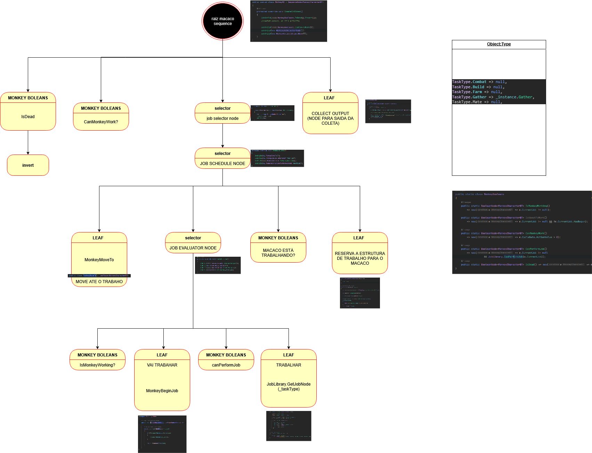

# GameDesign_AI_M2

Village Management Game using Behaviour Tree AI pattern.

## 🎮 Overview
A C# (Unity) project demonstrating a **Behaviour Tree**-driven AI system in a small **village management** game. Villagers perform actions like gathering, building, or idling based on BT logic.


## 🧱 Features
- Modular Behaviour Tree (Selector, Sequence, Action nodes)
- AI-controlled villagers reacting to environment and resources
- Expandable system for management gameplay (tasks, resources, buildings)
- Fully written in C# for clarity and extensibility

## ⚙️ Setup
1. Clone repo:
   ```bash
   git clone https://github.com/GPgabigob07/GameDesign_AI_M2.git
   ```
2. Open in **Unity** (or compatible C# environment).
3. Explore folders: `AI`, `Agents`, `Tasks`, `Buildings`.

## 🧠 Concepts
- **Behaviour Trees**: define agent decisions in modular nodes.
- **Village Simulation**: player manages villagers and resources, AI handles task logic.
- **Modular Design**: add new actions or behaviours without breaking core systems.

## 🚀 Future Ideas
- More behaviour nodes (timed tasks, teamwork)
- Dynamic world events
- UI for visualizing BTs in real-time

## 📚 Credit
Created by **GPgabigob07** for Game Design AI module (M2). Educational demo on AI architecture and management gameplay.
